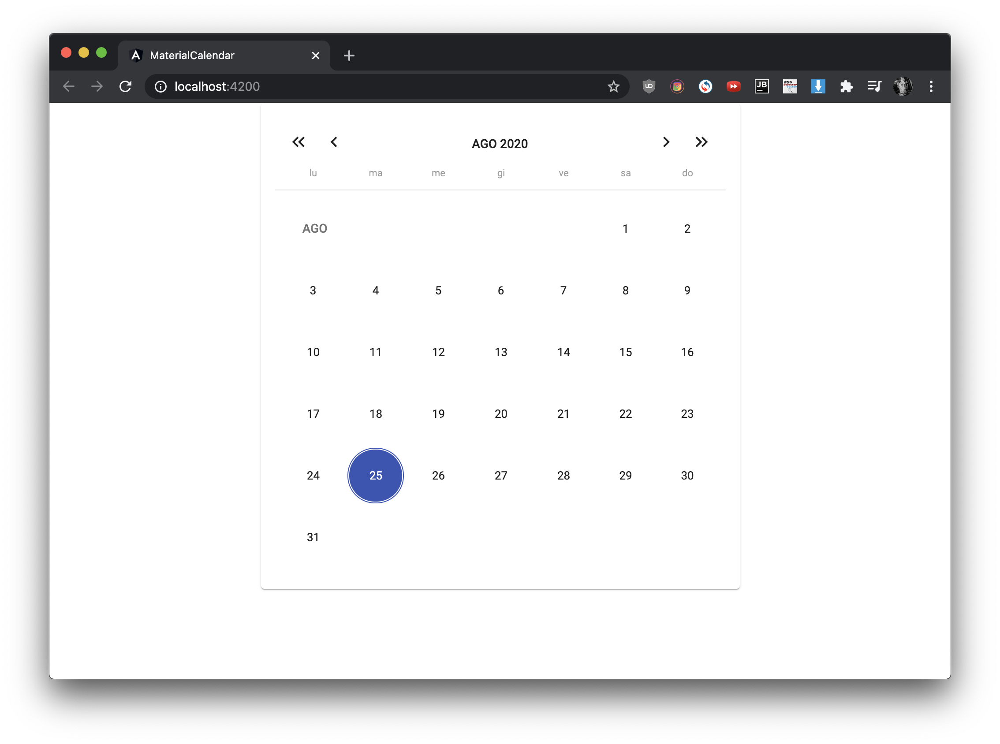

# MaterialCalendar

This project was generated with [Angular CLI](https://github.com/angular/angular-cli) version 10.0.5.

## Remember to install moment adapter
npm install @angular/material-moment-adapter  
- import following modules:  
    - MomentDateModule
    - MatDatepickerModule  
    - MatNativeDateModule
- export
    -  MatDatepickerModule
    - MatButtonModule
    

